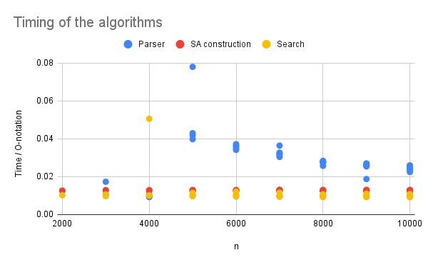

# Project 3: Suffix array construction

You should implement a suffix array construction algorithm. You can choose to implement the naive O(n² log n)-time construction algorithm based on just sorting all the suffixes using a comparison based algorithm, the O(n²) algorithm you get if you radix sort the suffixes, or you can use the suffix tree from project 2: If you run through the suffix tree, and traverse children in lexicographical order, you will see each leaf in lexicographical order as well, and if you collect all the leaf-labels you have your suffix array.

If you feel adventurous, you are also welcome to implement one of the linear time algorithms *skew* or *SAIS* that we will see the next two weeks, but then you will have to read a bit ahead.

Once you have constructed a suffix array you should use it to implement a binary-search based exact pattern matching. Since I haven’t taught you have to do it faster, it should run in O(m log n + z) where m is the length of the pattern, n is the length of the genome string, and z is the number of matches you output. (One of the algorithms you have seen multiplies z by m, but you know how to avoid this).

Implement the suffix array construction and the exact pattern matching in a single program called `sa`.  The program should take the same options as in project 1, so `sa genome.fa reads.fq`. The program should output (almost) the same Simple-SAM file. Because a search in a suffix array is not done from the start to the end of the string the output might be in a different order, but if you sort the output from the previous project and for this program, they should be identical.

## Evaluation

Once you have implemented the `sa` program (and tested it to the best of your abilities) fill out the report below, and notify me that your pull request is ready for review.

# Report

## Algorithm

We used the construction algorithm based on raddix sort. 
The algorithm has a running time of O(n²), which we will compare to the running time of our implementation below. 

## Insights you may have had while implementing the algorithm
I [Gaia] have learned a lot about C and how it compares to Python. 
Since I started writing the algorithms in Python, the differences became clear, 
when translated to C. 
Some consepts I have a better understanding of include pointers, 
structs, iterator pattern, header files, char as int, and strings.  
Some insights regarding Windows vs. Linux became clear, when we experienced problem, as described below. 

## Problems encountered if any
Due to privious projects not being finished, this project had to be made alongside those. 
We chose to focus on radix sort rather than more complicated algorithms like skew and SAIS to have more time.
Radix sort and binary search were not problematic in themselves, which gave us time to focus on the implementation.

The group added a new member, Gaia, who had almost no prior experience with writing C. 
Because of this, the first meeting of Gaia and Jonathan was focused on getting Gaia ready 
by running code from project 1. Running this on a Windows mashine (priviously only run on Linux and Mac) 
uncovered two problems in the code. 
1. Since Windows saves line breaks as \r\n a line break in files read with "r" will be counted as two chars,
which will make the string length longer than expected. This was solved by reading the file in binary mode "rb". 
2. When making the strict border array, the code was missing a check for whether bax[i]==0. Without this, the code tried 
to find index -1 of bax. By coincidence index -1 pointed to a place in memory which contained 0, the desired value, 
in every test. Probably since there was some relation between the location of bax and some other value. 
In Linux that is. When run on Windows, index -1 gave a very small negative number. This is not a problem with Windows, 
but an implementation error only discovered, because we ran it on Windows. 

The problems show the importance of running code on different OS, both to test whether it can run and to uncover errors
which were hidden by sheer coincidence. 

The week after this meeting each group member focused on a different project. Anna focused on project 1, 
Jonathan on project 2, and Gaia on project 3. Lastly, we used one full day together with project 3's code. 

We were close to not finish the code before deadline. Unfortunately we did not finish the report within this time. 
One problem we had was timing of the algorithms. We had problems with the editor being struck, since we made a lot of files.
A lot of time was wasted, waiting for the editor to index the files, only to crash. When we changed our strategy another 
problem became apperent. Since we did not have the time or knowledge to make proper use of free() we would quickly run 
out of memory when trying to run our tests, since we wanted to collect data from different n and m. We ran smaller 
batches to compensate. Ideally, we would have fixed it with better memory control. 
 

Regarding the implementation itself, the problems were mostly with the understanding of C and of-by-one errors. 

## Validation

We ran the algorithms known input and compared them to expected output. 
Those tests can bee seen in test/tests.c and test/testSearch.c. 

We also compared the results for randomly generated sequences and 
patterns with the results from project 1.

## Running time

We ran the code on sequences of all A's for varying n and m. 
Since the alphabet is constant parsing x should take O(n). Constructing the suffix array
should take O(n²), since we are using radix sort. And finding matches should take O(m log n + z).  
We ran the algorithms for n=2000..10000 and m=1000..9000. Since the output for these tests will always 
be relatively small, searching is done in O(m log n). In the figure below the time divided by the O-notation 
is plotted.

m is not shown directly in the plot, but for each n value, multiple m values are plotted. 
Since there is not much fluxuation (for some n) m must have the expected importance. 
Construction and search show a horizontal trend, which suggests that the O-notation is correct. 
The timing of the parser is not as neat, since for n=5000 it jumps before going down. It still, however, 
looks like it can be bounded by O(n), since it shows a downwards trend.  